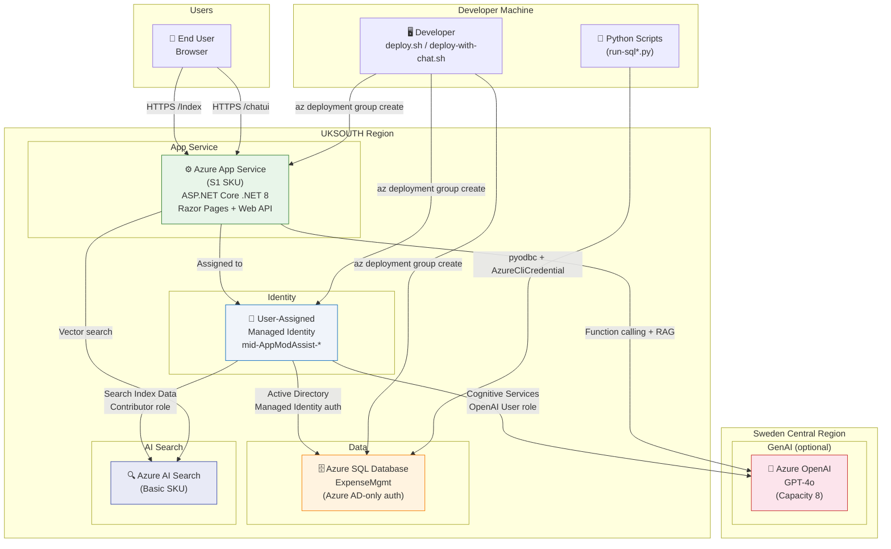

# Azure Services Architecture Diagram

This diagram shows the architecture of the Expense Management App deployed on Azure.



## Resource Summary

| Resource | Type | Region | SKU |
|---|---|---|---|
| App Service Plan | Microsoft.Web/serverfarms | uksouth | S1 |
| App Service | Microsoft.Web/sites | uksouth | - |
| User-Assigned MI | Microsoft.ManagedIdentity | uksouth | - |
| SQL Server | Microsoft.Sql/servers | uksouth | - |
| SQL Database | Microsoft.Sql/databases | uksouth | Basic |
| Azure OpenAI | Microsoft.CognitiveServices/accounts | swedencentral | S0 |
| AI Search | Microsoft.Search/searchServices | uksouth | Basic |

## Authentication Flow

```
App Service
    └── Managed Identity (mid-AppModAssist-*)
            ├── → Azure SQL: Active Directory Managed Identity (User Id=<clientId>)
            ├── → Azure OpenAI: Cognitive Services OpenAI User role via ManagedIdentityCredential
            └── → AI Search: Search Index Data Contributor + Search Service Contributor roles
```

## Deployment Order

1. Deploy Bicep (`infra/main.bicep`) — creates all resources
2. Configure App Service connection string with Managed Identity client ID
3. Add local machine IP to SQL firewall
4. Wait 30 seconds for SQL to be ready
5. Run `run-sql.py` — applies database schema
6. Run `run-sql-dbrole.py` — grants managed identity `db_datareader`, `db_datawriter`, `EXECUTE`
7. Run `run-sql-stored-procs.py` — deploys stored procedures
8. `dotnet publish` + zip + `az webapp deploy`
