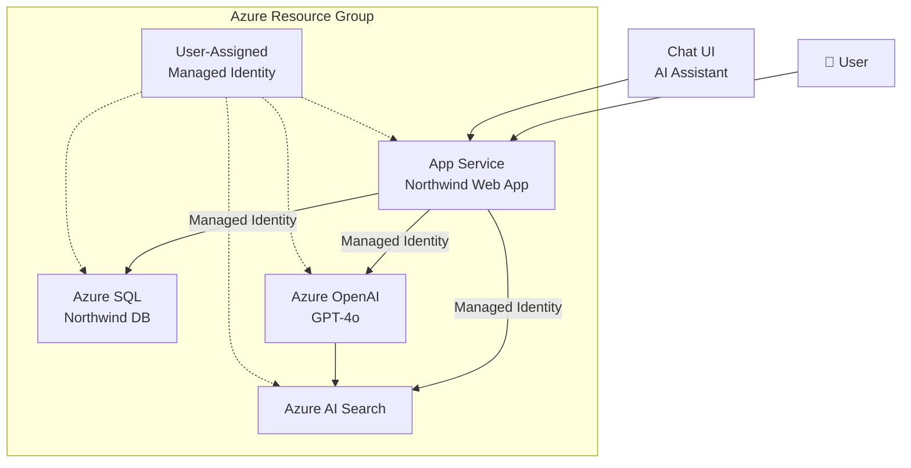

# Northwind Architecture Diagram

This diagram shows the Azure architecture for the modernised Northwind application.



## Components

| Component | SKU | Region |
|-----------|-----|--------|
| App Service Plan | Standard S1 | UK South |
| App Service | ASP.NET Core .NET 8 | UK South |
| Azure SQL Server | Entra ID Only Auth | UK South |
| Azure SQL Database | Basic Tier | UK South |
| Azure OpenAI | S0 | Sweden Central |
| Azure AI Search | Standard S0 | UK South |
| User-Assigned Managed Identity | - | UK South |

## Security Architecture

- **No passwords or API keys** — everything uses Managed Identity
- App Service authenticates to SQL using `Authentication=Active Directory Managed Identity`
- App Service authenticates to Azure OpenAI using `ManagedIdentityCredential`
- App Service authenticates to AI Search using `ManagedIdentityCredential`
- SQL Server configured with `azureADOnlyAuthentication: true`

## Deployment Flow

```
az group create → az deployment group create (main.bicep)
  → App Service + Managed Identity
  → Azure SQL (Entra ID admin, Basic DB)
  → (Optional) Azure OpenAI + AI Search
→ Configure App Service settings
→ Wait for SQL (30s) + Firewall rules
→ python3 run-sql.py (schema)
→ python3 run-sql-dbrole.py (roles)
→ python3 run-sql-stored-procs.py (procedures)
→ az webapp deploy (app.zip)
```
